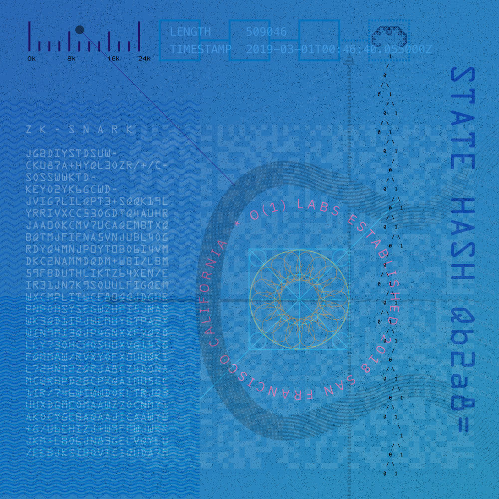
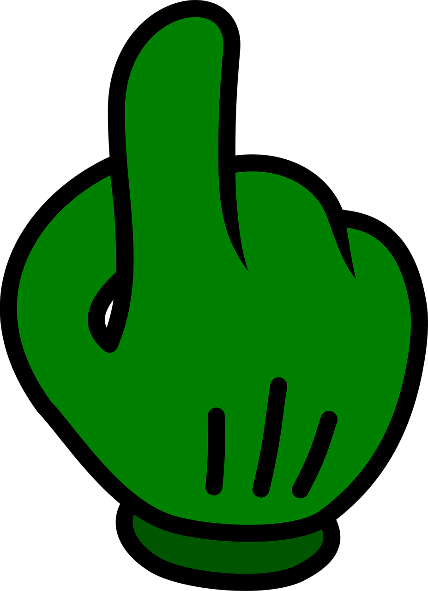
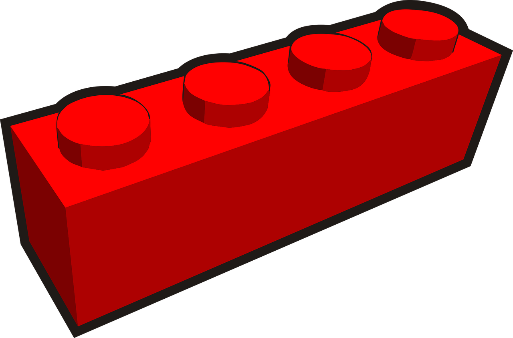
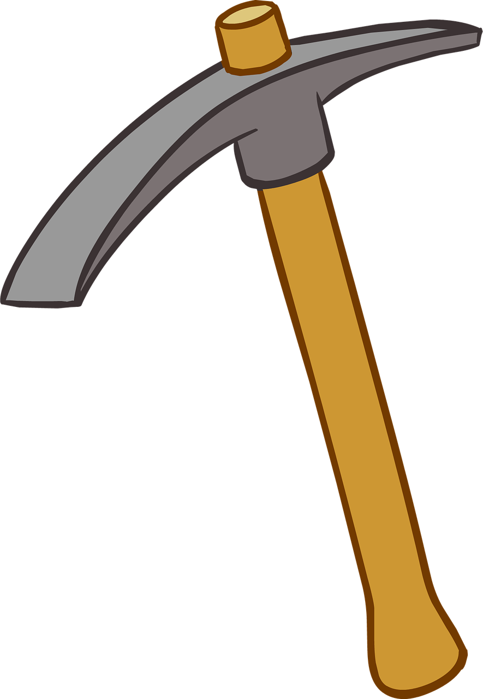
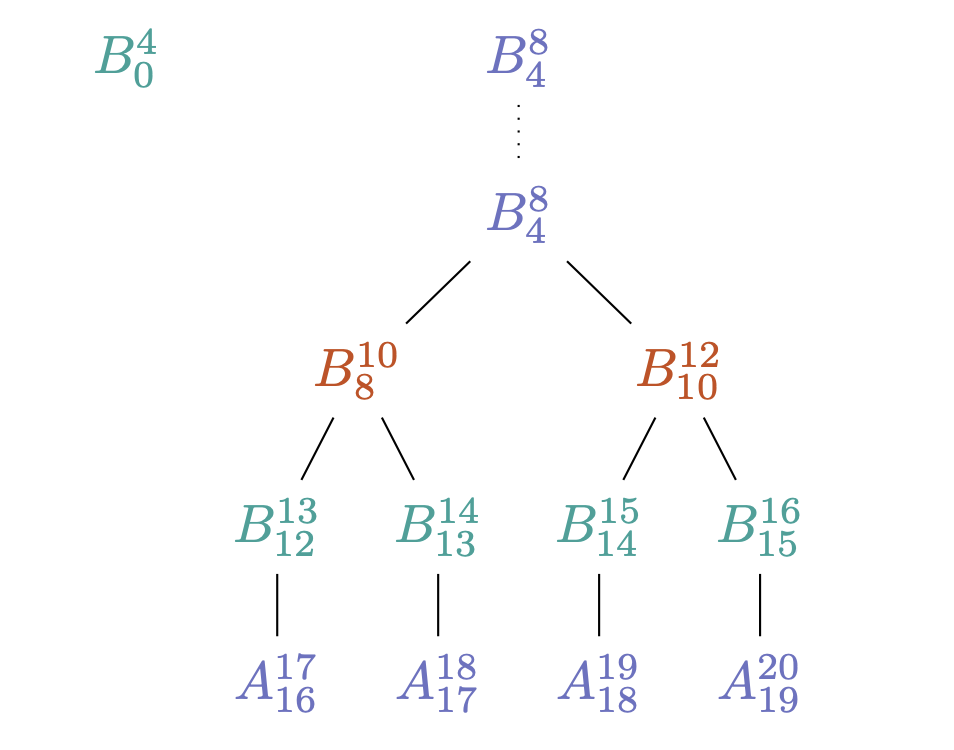
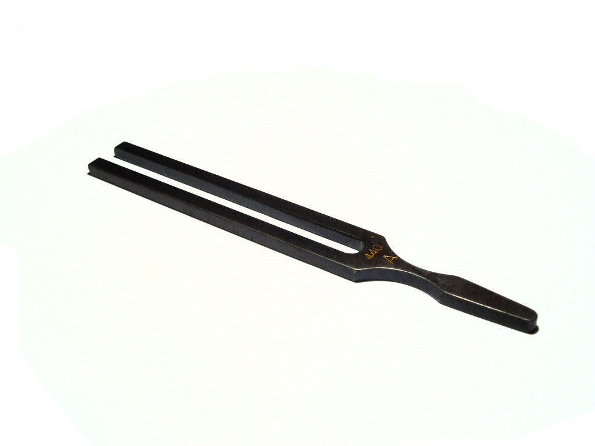

<!-- .slide: data-background="#2aa198" -->
<!-- .slide: data-state="terminal" -->
# Coda Protocol Deepdive

By
<a href="http://bkase.com">Izaak Meckler</a> / <a href="http://twitter.com/izmeckler">@imeckler</a> and
<a href="http://bkase.com">Brandon Kase</a> / <a href="http://twitter.com/bkase_">@bkase_</a>

!!!

### Coda

!!!

### Coda is...

* something
* we love OCaml just like tezos

!!!

### zk-SNARKs

!!!

### Roles in Coda

> https://www.flickr.com/photos/isbg6/5029147286

Note: 3 Roles!

!!!

### Roles in Coda

1. End-user

!!!

### End-user

> https://pixabay.com/vectors/finger-fist-glove-gun-hand-point-2029729/

Note: Maybe you're delegating your stake, but you want to be able to check your balance, or make a transaction. Maybe you're using a hardware wallet

!!!

### End-user: Non-consensus node

> https://upload.wikimedia.org/wikipedia/commons/thumb/9/9c/Magnifying_glass_CC0.svg/512px-Magnifying_glass_CC0.svg.png

Note: Non-consensus node; unlike a light-node in other networks, does fully verify the state (as easy as checking a snark)

!!!

### End-user: Node Requirements

* A computer
* <!-- .element: class="fragment" data-fragment-index="2" --> Browser <!-- .element: class="fragment" data-fragment-index="2" -->

Note: Very low resource requirements (on the order of 100kb of state) ; even Safari on ios

!!!

### Roles in Coda

1. ~~End-user~~
2. Staker

!!!

### Staker

> http://pngimg.com/uploads/coin/coin_PNG36877.png

Note: "Validator" or "Baker"; this is a node that will stake and participate in the network

!!!

### Staker: Block producer

> https://www.needpix.com/photo/download/598075/building-block-plastic-toy-red-architecture-free-vector-graphics-free-pictures-free-photos-free-images

Note: The staker runs consensus (which we'll touch on later) and hopes to produce blocks. ...

!!!

### Staker: Node requirements

* Harddrive space to store the ledger
* <!-- .element: class="fragment" data-fragment-index="1" --> Compute to produce SNARKs fast <!-- .element: class="fragment" data-fragment-index="1" -->
* <!-- .element: class="fragment" data-fragment-index="2" --> Good uptime <!-- .element: class="fragment" data-fragment-index="2" -->

!!!

### Roles in Coda

1. ~~End-user~~
2. ~~Staker~~
3. Snark worker

!!!

### Snark Worker

> https://www.needpix.com/photo/download/1195100/pickax-tool-dig-build-construction-dwarf-mining-mine-design

Note: The snark worker is unique to our network 

!!!

### Snark Worker

</img>

!!!

### Snark Worker: ?? Node

!!!

### Snark Worker: Snarketplace

> https://pixabay.com/photos/marketplace-candy-sweets-market-4121997/

!!!

### Roles in the network

Three roles

* <!-- .element: class="fragment" data-fragment-index="1" --> End-user <!-- .element: class="fragment" data-fragment-index="1" -->
* <!-- .element: class="fragment" data-fragment-index="2" --> Block producer <!-- .element: class="fragment" data-fragment-index="2" -->
* <!-- .element: class="fragment" data-fragment-index="3" --> Snark Worker <!-- .element: class="fragment" data-fragment-index="3" -->

!!!

### Consensus

!!!

### Ouroboros

> https://upload.wikimedia.org/wikipedia/commons/f/fa/Ouroboros.png

!!!

### Ouroboros variants

* Vanilla
* <!-- .element: class="fragment" data-fragment-index="1" --> Praos <!-- .element: class="fragment" data-fragment-index="1" -->
* <!-- .element: class="fragment" data-fragment-index="2" --> Genesis <!-- .element: class="fragment" data-fragment-index="2" -->
* <!-- .element: class="fragment" data-fragment-index="3" --> Codaboros <!-- .element: class="fragment" data-fragment-index="3" -->

!!!

### Ouroboros Basics

!!!

### Praos: VRFs

!!!

### Genesis: Long forks

> https://upload.wikimedia.org/wikipedia/commons/5/5d/A440_Tuning_Fork.jpg

!!!

### Codaboros: No history, long forks

todo

Note: We're working on formal proofs of liveness/safety (right ihm?)

!!!

### Codaboros in a SNARK

todo

!!!

<!-- .slide: data-background="#2aa198" -->
<!-- .slide: data-state="terminal" -->
# Thanks!

Join our Discord! <a href=https://bit.ly/CodaDiscord>bit.ly/CodaDiscord</a>

By
<a href="http://bkase.com">Izaak Meckler</a> / <a href="http://twitter.com/izmeckler">@imeckler</a> and
<a href="http://bkase.com">Brandon Kase</a> / <a href="http://twitter.com/bkase_">@bkase_</a>

