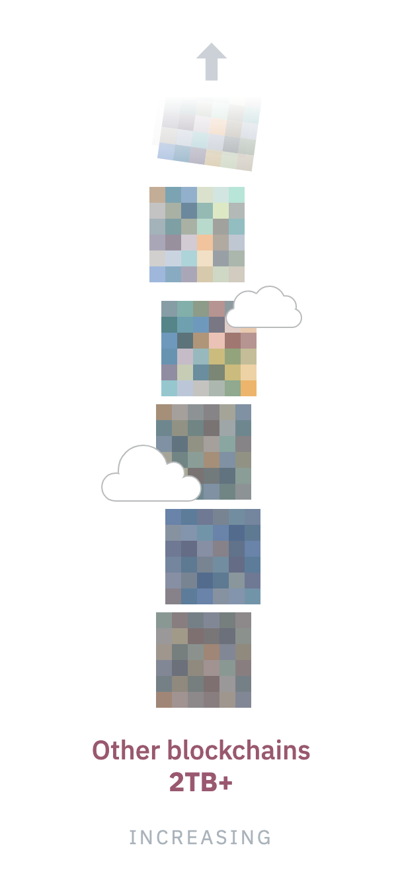

<!-- .slide: data-background="#2aa198" -->
<!-- .slide: data-state="terminal" -->
# Coda Protocol and zkSNARKs

By
<a href="http://bkase.com">Brandon Kase</a> / <a href="http://twitter.com/bkase_">@bkase_</a>

!!!

### Coda

!!!

### Existing blockchains

!!!

### Existing blockchains

!!!

### Existing blockchains

!!!

### Existing blockchains

!!!

### Existing blockchains

!!!

### Existing blockchains

!!!

### Hard to interact with

Note: Difficult to use

!!!

### Fewer full nodes

Note: Risk of centralization

!!!

### Existing networks

Large blockchains make them:

1. Hard to interact with
2. Risk of centralization

!!!

!!!

### Coda

* Stays Decentralized
* <!-- .element: class="fragment" data-fragment-index="1" --> Easy to interact with <!-- .element: class="fragment" data-fragment-index="1" --> => more useful applications <!-- .element: class="fragment" data-fragment-index="2" -->

Note: Which leads to

!!!

### Coda's Decentralization

* Zero knowledge proofs (specifically zkSNARKs)
* <!-- .element: class="fragment" data-fragment-index="1" --> Inclusive consensus <!-- .element: class="fragment" data-fragment-index="1" -->

!!!

### zk-SNARKs

*Proof* that a computation was run correctly that is *tiny* (~1 kB) <!-- .element: class="fragment" data-fragment-index="1" --> and *easy to check* (&lt;100 ms) <!-- .element: class="fragment" data-fragment-index="2" -->

^^ *Certificate* model <!-- .element: class="fragment" data-fragment-index="3" -->

!!!

### zkSNARKs as certificates

Note: Photograph of something as a certificate that this thing exists

!!!

!!!

!!!

!!!

!!!

!!!

!!!

### Coda's Decentralization

* Zero knowledge proofs (specifically zkSNARKs)
* *Inclusive consensus*

!!!

### Inclusive Consensus

> https://upload.wikimedia.org/wikipedia/commons/f/fa/Ouroboros.png

Note: Discovered by the folks at IOHK

!!!

### Inclusive Consensus

!!!

### Inclusive Consensus

* No slashing
* <!-- .element: class="fragment" data-fragment-index="1" --> No bonds <!-- .element: class="fragment" data-fragment-index="1" -->
* <!-- .element: class="fragment" data-fragment-index="2" --> No minimum amount to stake <!-- .element: class="fragment" data-fragment-index="2" -->
* <!-- .element: class="fragment" data-fragment-index="3" --> Easy to get started, low risk (because above) <!-- .element: class="fragment" data-fragment-index="3" -->

!!!

### Coda's Decentralization

* Zero knowledge proofs (specifically zkSNARKs)
* Inclusive consensus

!!!

### Coda

* Stays Decentralized
* <!-- .element: class="fragment" data-fragment-index="1" --> *Easy to interact with* <!-- .element: class="fragment" data-fragment-index="1" --> => more useful applications <!-- .element: class="fragment" data-fragment-index="1" -->

Note: Which leads to

!!!

### Coda Usability

We are investing heavily in *user experience* for node operators and developers

!!!

### Coda Everywhere

Note: Non-consensus node; unlike a light-node in other networks, does fully verify the state (as easy as checking a snark); no need to delegate trust

!!!

### Coda in the browser

!!!

### Coda

* Stays Decentralized
* Easy to interact with  *=> more useful applications*  <!-- .element: class="fragment" data-fragment-index="1" -->

!!!

### Coda Applications

Coda is early in development custom tokens, tokenized assets, games <!-- .element: class="fragment" data-fragment-index="1" -->

!!!

### Coda Applications

And *zksnark apps*

!!!

### zk-SNARKs

*Proof* that a computation was run correctly that is *tiny* (~1 kB) <!-- .element: class="fragment" data-fragment-index="1" --> and *easy to check* (&lt;100 ms) <!-- .element: class="fragment" data-fragment-index="2" -->

^^ *Certificate* model <!-- .element: class="fragment" data-fragment-index="3" -->

!!!

### zkSNARKs

*Proof* that there exists secret data<!-- .element: class="fragment" data-fragment-index="1" --> that I know,<!-- .element: class="fragment" data-fragment-index="2" --> such that some *predicate* holds on the data<!-- .element: class="fragment" data-fragment-index="3" -->

^^ *Hiding* model<!-- .element: class="fragment" data-fragment-index="4" -->

!!!

### zkSNARK statements

 _There exists_ data _such that_ predicates hold on that data<!-- .element: class="fragment" data-fragment-index="1" -->

Note: There exists DATA s.t. PROPERTY

!!!

### zkSNARK statements

 _There exists_ some number x _such that_ x^2 = 9<!-- .element: class="fragment" data-fragment-index="1" -->

!!!

### Coda zkSNARK Application

 _There exists_ several bank accounts and real estate assets my business owns,  _such that_ the sum of the accounts is above 10billion won<!-- .element: class="fragment" data-fragment-index="1" --> therefore please give me a good interest rate on this business loan<!-- .element: class="fragment" data-fragment-index="2" -->

Your private information *remains* private<!-- .element: class="fragment" data-fragment-index="3" -->

!!!

### Coda

* Stays Decentralized
* Easy to interact with  => more useful applications 

!!!

### Genesis program

!!!

### Genesis Program

https://codaprotocol.com/genesis

* Help us strengthen Coda Protocol
* <!-- .element: class="fragment" data-fragment-index="1" --> Genesis members will receive a distribution of *66,000 tokens* at launch <!-- .element: class="fragment" data-fragment-index="1" -->
* <!-- .element: class="fragment" data-fragment-index="2" --> *1000 members* will be selected <!-- .element: class="fragment" data-fragment-index="2" -->
* <!-- .element: class="fragment" data-fragment-index="3" --> At mainnet launch, *6.6% of the protocol will be distributed* in this manner <!-- .element: class="fragment" data-fragment-index="3" -->
* <!-- .element: class="fragment" data-fragment-index="4" --> To learn more see the Terms and Conditions on the genesis page <!-- .element: class="fragment" data-fragment-index="4" -->

!!!

<!-- .slide: data-background="#2aa198" -->
<!-- .slide: data-state="terminal" -->
# Thanks

* Community: <a href=https://bit.ly/CodaDiscord>bit.ly/CodaDiscord</a>
* Follow our progress: <a href="https://twitter.com/codaprotocol">@CodaProtocol</a>
* Website: <a href="https://codaprotocol.com">codaprotocol.com</a>
* Genesis Program: <a href="https://codaprotocol.com/genesis">codaprotocol.com/genesis</a>

By
<a href="http://bkase.com">Brandon Kase</a> / <a href="http://twitter.com/bkase_">@bkase_</a>

