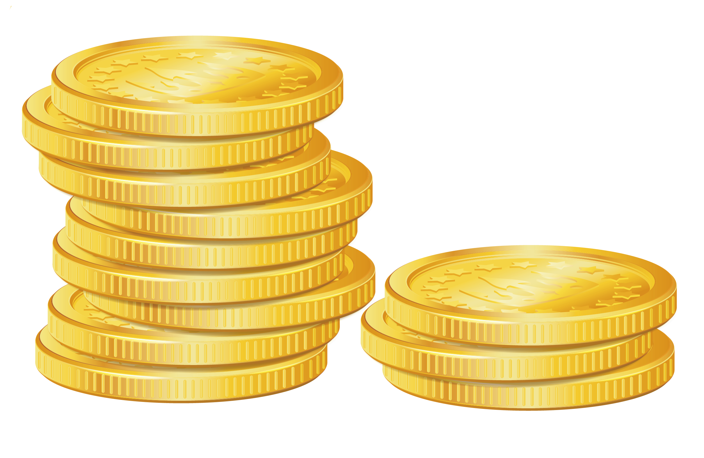

<!-- .slide: data-background="#2aa198" -->
<!-- .slide: data-state="terminal" -->
# Coda Protocol Deepdive

By
<a href="http://bkase.com">Izaak Meckler</a> / <a href="http://twitter.com/izmeckler">@imeckler</a> and
<a href="http://bkase.com">Brandon Kase</a> / <a href="http://twitter.com/bkase_">@bkase_</a>

Note: We'll save lots of time at the end for questions

!!!

### Coda

!!!

### Coda is...

A fully-succinct, proof-of-stake blockchain and cryptocurrency.

!!!

!!!

!!!

!!!

!!!

!!!

!!!

!!!

!!!

!!!

!!!

!!!

!!!

### zk-SNARKs

- Proof that a computation was run correctly
- Tiny (~1 kB) and easy to check (~10 ms)

!!!

### zk-SNARKs in Coda

- Block producers make SNARKs
- Blocks include a big tree-of-SNARKs SNARK
  - Could be produced by anyone

!!!

### Roles in Coda

> https://www.flickr.com/photos/isbg6/5029147286

Note: 3 Roles!

!!!

### Roles in Coda

1. Non-consensus

!!!

### Non-consensus Actor

> https://pixabay.com/vectors/finger-fist-glove-gun-hand-point-2029729/

Note: Maybe you're delegating your stake, but you want to be able to check your balance, or make a transaction. Maybe you're using a hardware wallet

!!!

### Non-consensus Node

> https://upload.wikimedia.org/wikipedia/commons/thumb/9/9c/Magnifying_glass_CC0.svg/512px-Magnifying_glass_CC0.svg.png

Note: Non-consensus node; unlike a light-node in other networks, does fully verify the state (as easy as checking a snark)

!!!

### Non-consensus Node: Requirements

* A computer
* <!-- .element: class="fragment" data-fragment-index="2" --> Browser <!-- .element: class="fragment" data-fragment-index="2" -->

Note: Very low resource requirements (on the order of 100kb of state) ; even Safari on ios

!!!

### Roles in Coda

1. ~~Non-consensus~~
2. Snark Worker

!!!

### Snark Worker

> https://www.needpix.com/photo/download/1195100/pickax-tool-dig-build-construction-dwarf-mining-mine-design

Note: The snark worker is unique to our network ;; to really understand what this actor does I need to talk about...

!!!

### Snarketplace

> https://pixabay.com/photos/marketplace-candy-sweets-market-4121997/

Note: Snark worker is one of the actors in the snarketplace

!!!

### Snarketplace Details

* Fixed-size work queue of txns that need to be SNARKed
* <!-- .element: class="fragment" data-fragment-index="1" --> Transactions to the back of the queue  <!-- .element: class="fragment" data-fragment-index="1" -->
* <!-- .element: class="fragment" data-fragment-index="2" --> Snark workers peek at work at front of queue and sell the SNARKs <!-- .element: class="fragment" data-fragment-index="2" -->
* <!-- .element: class="fragment" data-fragment-index="3" --> Block producers pop work at front, replace with SNARKs, and push transactions to the back <!-- .element: class="fragment" data-fragment-index="3" -->

!!!

### Snark Worker Perspective

* Listens for new transactions added in blocks
* <!-- .element: class="fragment" data-fragment-index="1" --> Create Transaction SNARKs (with fee attached) <!-- .element: class="fragment" data-fragment-index="1" -->
* <!-- .element: class="fragment" data-fragment-index="2" --> Gossips SNARKs around for later queue popping <!-- .element: class="fragment" data-fragment-index="2" -->

Note: Fee and author public-key can be embedded inside the snark using a signature of knowledge ;; SNARKs are stored in a separate mempool from txns we call the snark pool

!!!

### Snark Worker Perspective

</img>

Note: End result; tree of proofs

!!!

### Snark Worker: Snark Worker Node

* Always-on, cheap compute
* Public-keys only

Note: Proving SNARKs constantly, and needs to offer lower fees than others. Doesn't need private keys ;; similar in specs to a proof-of-work node in other networks

!!!

### Roles in Coda

1. ~~Non-conesnsus~~
2. ~~Snark worker~~
3. Block producer

!!!

### Block producer

> http://pngimg.com/uploads/coin/coin_PNG36877.png

Note: "Validator" or "Baker"; this is a node that will stake and participate in the network

!!!

### Block producer

> https://www.needpix.com/photo/download/598075/building-block-plastic-toy-red-architecture-free-vector-graphics-free-pictures-free-photos-free-images

Note: The staker runs consensus (which we'll touch on later) and hopes to produce blocks. ...

!!!

### Recall: Snarketplace

* Fixed-size work queue of txns that need to be SNARKed
* <!-- .element: class="fragment" data-fragment-index="1" --> Transactions to the back of the queue  <!-- .element: class="fragment" data-fragment-index="1" -->
* <!-- .element: class="fragment" data-fragment-index="2" --> Snark workers peek at work at front of queue and sell the SNARKs <!-- .element: class="fragment" data-fragment-index="2" -->
* <!-- .element: class="fragment" data-fragment-index="3" --> Block producers pop work at front, replace with SNARKs, and push transactions to the back <!-- .element: class="fragment" data-fragment-index="3" -->

!!!

### Block Production

* Buy SNARKs from the Snarketplace
* <!-- .element: class="fragment" data-fragment-index="1" --> Add new txns to cover prices of Snarketplace SNARKs and profit <!-- .element: class="fragment" data-fragment-index="1" -->
* <!-- .element: class="fragment" data-fragment-index="2" --> Create the new succinct blockchain SNARK <!-- .element: class="fragment" data-fragment-index="2" -->
* <!-- .element: class="fragment" data-fragment-index="3" --> Gossip it and some metadata around the network <!-- .element: class="fragment" data-fragment-index="3" -->

Note: Found in snarkpool that snark workers have gossipped

!!!

### Block Producer: Node requirements

* Harddrive space to store the ledger
* <!-- .element: class="fragment" data-fragment-index="1" --> Compute to produce SNARKs fast <!-- .element: class="fragment" data-fragment-index="1" -->
* <!-- .element: class="fragment" data-fragment-index="2" --> Good uptime <!-- .element: class="fragment" data-fragment-index="2" -->

!!!

### Roles in the network

Three roles

* <!-- .element: class="fragment" data-fragment-index="1" --> Non-conesnsus <!-- .element: class="fragment" data-fragment-index="1" -->
* <!-- .element: class="fragment" data-fragment-index="2" --> Snark worker <!-- .element: class="fragment" data-fragment-index="2" -->
* <!-- .element: class="fragment" data-fragment-index="3" --> Block producer <!-- .element: class="fragment" data-fragment-index="3" -->

!!!

### Consensus

!!!

### Ouroboros

> https://upload.wikimedia.org/wikipedia/commons/f/fa/Ouroboros.png

Note: Discovered by the folks at IOHK

!!!

### Ouroboros variants

* Vanilla
* <!-- .element: class="fragment" data-fragment-index="1" --> Praos <!-- .element: class="fragment" data-fragment-index="1" -->
* <!-- .element: class="fragment" data-fragment-index="2" --> Genesis <!-- .element: class="fragment" data-fragment-index="2" -->
* <!-- .element: class="fragment" data-fragment-index="3" --> Codaboros <!-- .element: class="fragment" data-fragment-index="3" -->

!!!

### Ouroboros Basics

* Time is broken into epochs
* <!-- .element: class="fragment" data-fragment-index="1" --> Stake is counted a 1-2 epochs in the past <!-- .element: class="fragment" data-fragment-index="1" -->
* <!-- .element: class="fragment" data-fragment-index="2" --> Select longest fork to decide which chain is stronger <!-- .element: class="fragment" data-fragment-index="2" -->

Note: Like tezos, cycles of blocks are like epochs ;; just like in tezos, counted a few cycles in the past

!!!

### Praos: VRFs

* Praos adds support for a secret, secure weighted dice roll
* <!-- .element: class="fragment" data-fragment-index="1" --> Uses verifiable random functions <!-- .element: class="fragment" data-fragment-index="1" -->

!!!

### Genesis: Long forks

> https://upload.wikimedia.org/wikipedia/commons/5/5d/A440_Tuning_Fork.jpg

Note: Look at 

!!!

### Codaboros: No history, long forks

todo @ihm

Note: We're working on formal proofs of liveness/safety (right ihm?)

!!!

### Codaboros in a SNARK

todo @ihm

!!!

<!-- .slide: data-background="#2aa198" -->
<!-- .slide: data-state="terminal" -->
# Questions?

Join our Discord! <a href=https://bit.ly/CodaDiscord>bit.ly/CodaDiscord</a>

By
<a href="http://bkase.com">Izaak Meckler</a> / <a href="http://twitter.com/izmeckler">@imeckler</a> and
<a href="http://bkase.com">Brandon Kase</a> / <a href="http://twitter.com/bkase_">@bkase_</a>

